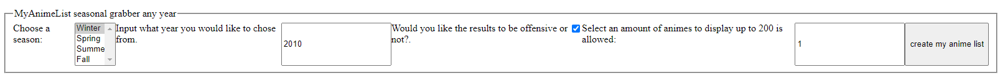
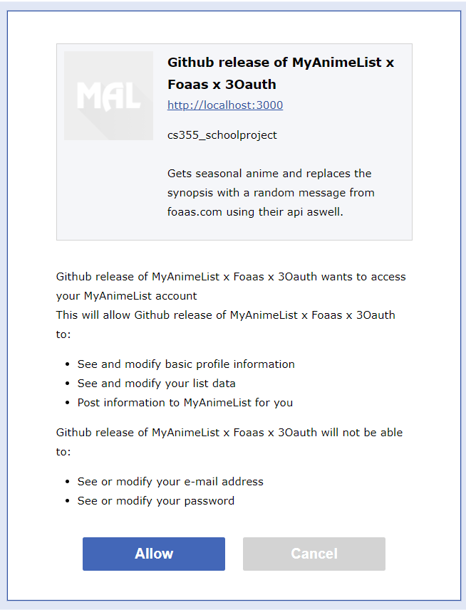
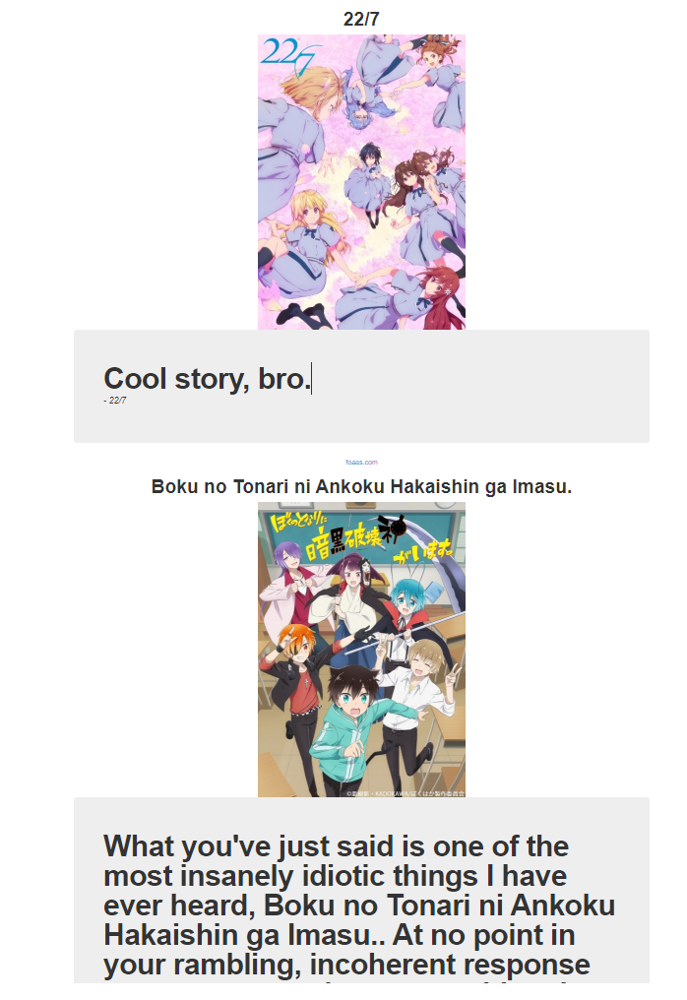

# MyAnimeList x Foaas x 3Oauth - Random Anime suggestor
 This was a project to demonstrate synchronously use Nodejs to do a 3 legged Oauth handshake. Then use myanimelist to randomly suggest an anime. Then to use the name of the suggested anime to give a funny random synopsis of the anime using the FOAAS api services.

To run this program you will need Nodejs installed.
steps to run:
	1) open windows powershell or any commandline tool in the location of the downloaded files.
	2) type in node index.js
	3) go to your browser and type in localhost:3000
	4) Put in the season, year, and how many animes you would like to see up to 200.
	Optional: If you would like offensive or non offensive joke suggestions, tick the box!
	
# Images
Example Splash	          
:-------------------------:|
	
	
Example auth           |  Result image
:-------------------------:|:-------------------------:
			  |  	